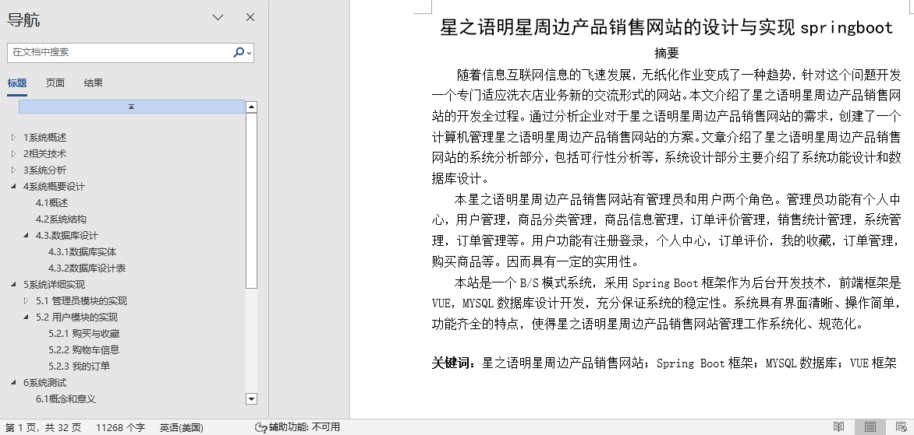
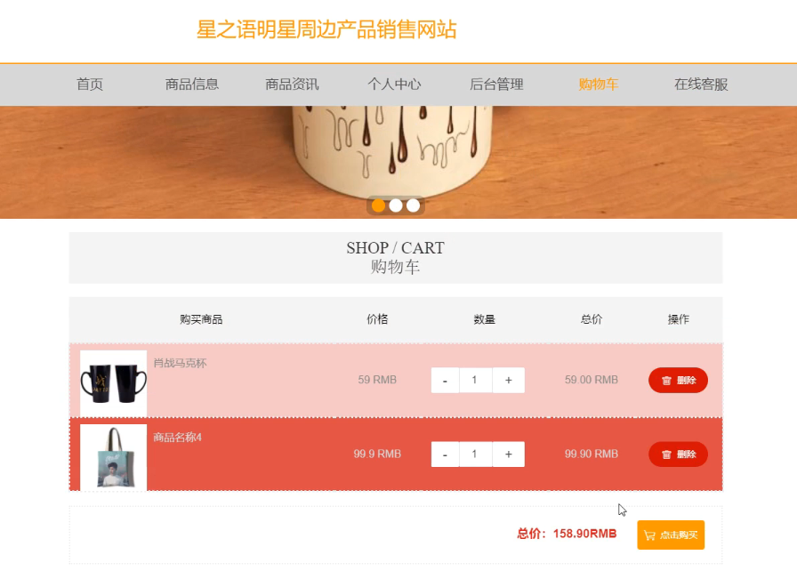
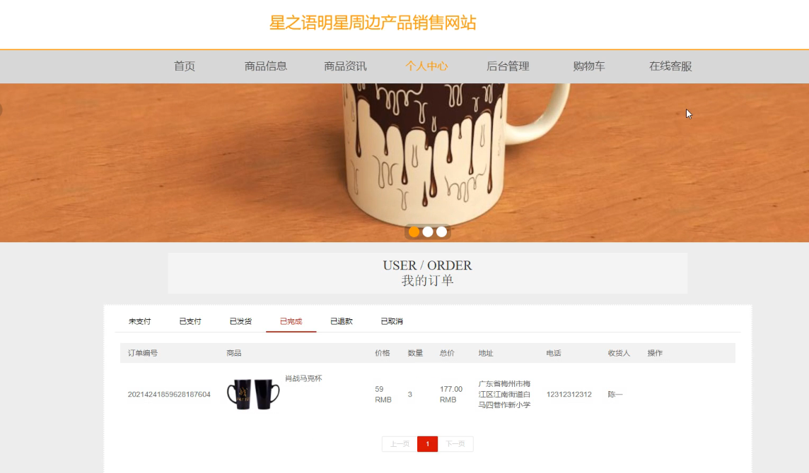
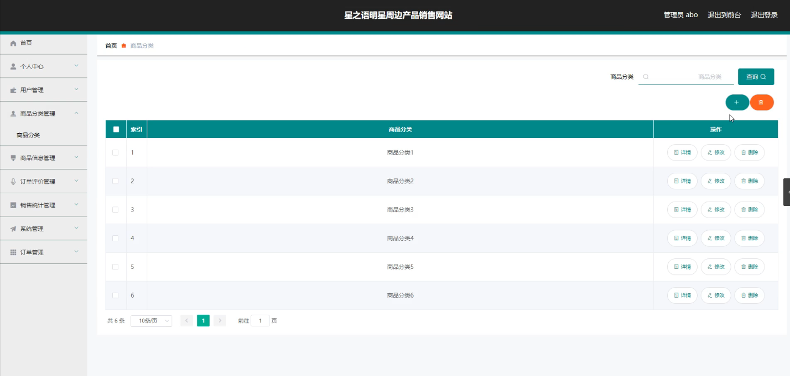
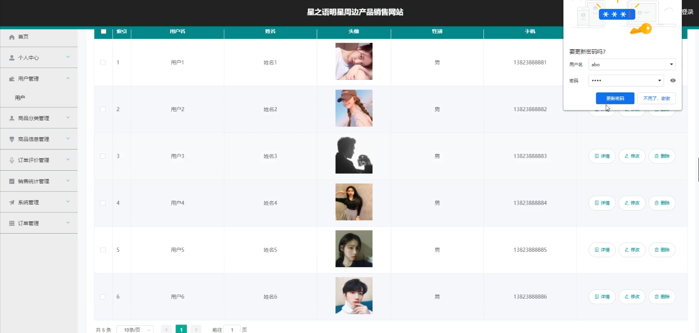
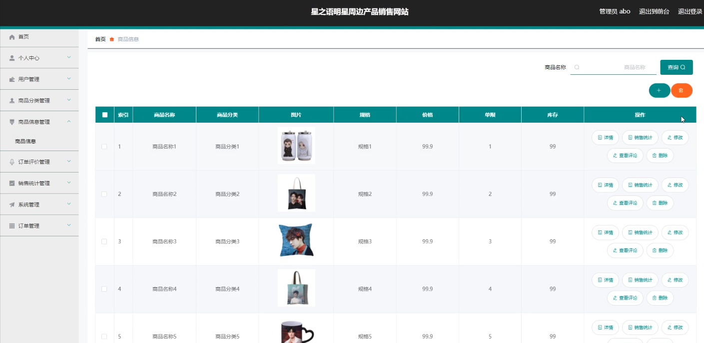
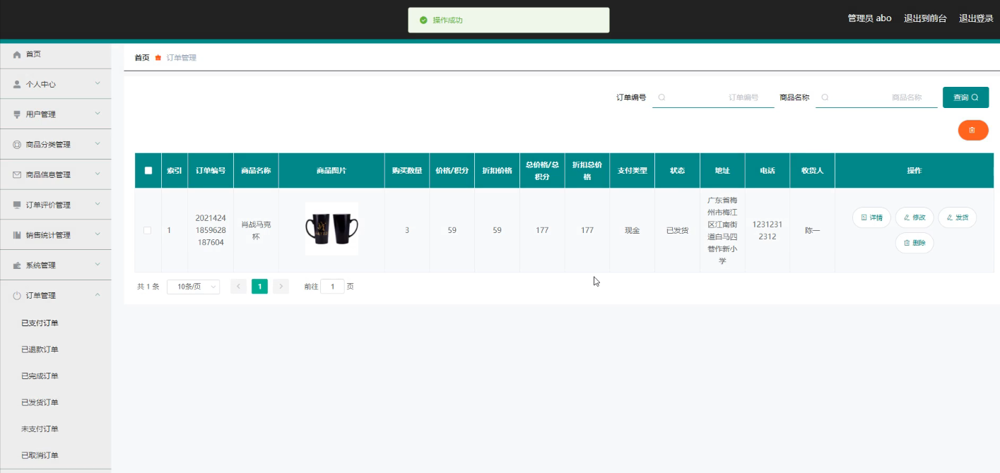
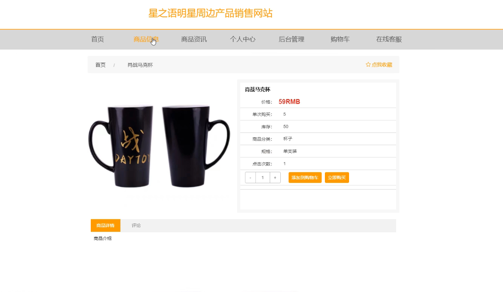

## 星之语明星周边产品销售网站(程序+报告)

###  获取sql数据库文件: 从戎源码网 (https://armycodes.com/) QQ: 386869957 QQ群: 377586148
###  所有系统地址: (https://github.com/YuLin-Coder/AllProjectCatalog) 
###  所有项目以及源代码本人均调试运行无问题 可支持远程安装部署调试、定制修改、代码讲解

## 项目介绍
星之语明星周边产品销售网站，系统包含两种角色：用户、管理员，系统分为前台和后台两大模块，主要功能如下：

1 管理员模块的实现
- 商品分类管理: 系统管理员可以对商品分类进行添加、修改、删除和查询操作。
  
- 用户信息管理: 系统管理员可以对用户信息进行添加、修改、删除和查询操作。

- 商品信息管理: 系统管理员可以对商品信息进行添加、修改和删除操作。

- 订单信息管理: 系统管理员可以对订单信息进行查询和发货操作。

2 用户模块的实现
- 购买与收藏: 用户可以在商品详情页面进行购买或收藏操作。

- 购物车信息: 用户可以查看购物车中的商品信息，选择移除、修改数量或进行结算操作。

- 我的订单: 用户可以查看自己的订单信息。

## 项目技术
- 编程语言：Java
- 数据库：MySQL
- 项目管理工具：Maven
- 前端技术：HTML、CSS、JavaScript、Vue
- 后端技术：Spring、SpringMVC、MyBatis

## 运行环境
- JDK版本：JDK1.8及以上
- 开发工具：IDEA、Ecplise、Myecplise都可以
- 数据库: MySQL5.7及以上
- Maven：maven3.0及以上
- Node：14.14.0及以上

## 运行截图

